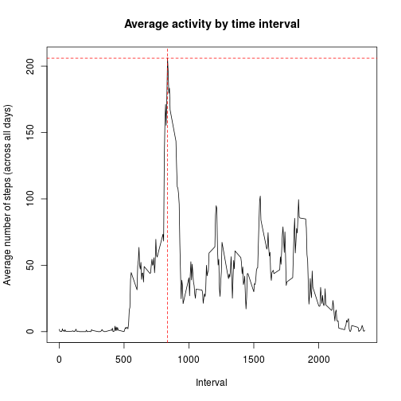

This R markdown file contains all the procedures taken to analyze the data, with comments in a multitude of parts.

## Loading and preprocessing the data

First, we need to load the data. Since the file is in csv, just using *read.csv* is enough.

```r
activity<-read.csv('activity.csv')
str(activity)
```

```
## 'data.frame':	17568 obs. of  3 variables:
##  $ steps   : int  NA NA NA NA NA NA NA NA NA NA ...
##  $ date    : Factor w/ 61 levels "2012-10-01","2012-10-02",..: 1 1 1 1 1 1 1 1 1 1 ...
##  $ interval: int  0 5 10 15 20 25 30 35 40 45 ...
```
As we can see, the dates are not in the adequate class, so I used *as.Date* on it. I also transformed the data frame into a tibble object to facilitate procedures on other parts of the code.

```r
#Changing variable class
activity$date<-as.Date(activity$date,'%Y-%m-%d')
library(dplyr)
#Transforming to tibble
activity<-as_tibble(activity)
```

## What is mean total number of steps taken per day?

First, I produced a new data frame from the original, containing the total number of steps taken at each day. I also removed the NA's, as requested.

```r
#Total number of steps per day
StepsDay<-activity%>%
  #Removing NA
  filter(!is.na(steps))%>%
  #Grouping by date
  group_by(date)%>%
  #Obtaining total steps per day
  summarise(sum(steps))
```
Now that the data frame was created, we can provide the histogram and the centrality measures that were asked.

```r
#Histogram
hist(StepsDay$`sum(steps)`,xlab='Total number of steps per day',main='Histogram of total number of steps per day')
```


```r
#Mean and median
c(mean(StepsDay$`sum(steps)`),median(StepsDay$`sum(steps)`))
```

```
## [1] 10766.19 10765.00
```

## What is the average daily activity pattern?

In this case, we need to produce another data frame from the original one. This time grouping by intervals, instead of dates, and obtaining the mean, instead of the sum.

```r
MeanDay<-activity%>%
  #Removing NA
  filter(!is.na(steps))%>%
  #Grouping by time interval
  group_by(interval)%>%
  #mean of steps across all days (by interval)
  summarise(mean(steps))
```
Now, we can easily plot the required time series **and** check which of the 5-minute intervals contains the maximum number of steps.

```r
#Plot
plot(MeanDay$interval,MeanDay$`mean(steps)`,xlab='Interval',ylab='Average number of steps (across all days)',type='l',main='Average activity by time interval')
```


```r
#Interval with the maximum number of steps (on average)
MeanDay[which.max(MeanDay$`mean(steps)`),]
```

```
## # A tibble: 1 x 2
##   interval `mean(steps)`
##      <int>         <dbl>
## 1      835          206.
```
As we can see, it is the interval that begins after 835 minutes, returning a mean of 206. If we cross-examine this mean with the plot, we can see that it really is the case by checking where the red dashed lines cross (plot below).

```r
#Plot
plot(MeanDay$interval,MeanDay$`mean(steps)`,xlab='Interval',ylab='Average number of steps (across all days)',type='l',main='Average activity by time interval')
abline(h=206,lty=2,col='red')
abline(v=835,lty=2,col='red')
```




## Imputing missing values

Here, we will need to provide a method for imputing values where the number of steps is missing. But first, we just need to check how many NA's this dataset contains.

```r
ind<-is.na(activity$steps)
#Total number of missing values in the dataset
sum(ind)
```

```
## [1] 2304
```
From this information, we conclude that 2304 observations (lines of the data frame) do not contain the number of steps.

Now, to the imputation procedure. The method of choice was to use the values at the **MeanDay** data frame to provide a suggested value. At each interval without a number of steps, I changed the missing value to the mean of such interval. The new dataset was called **imput.activity**.

```r
#Copying original dataset
imput.activity<-activity
#Filling NA's with the average number of steps for that interval
for(i in names(table(activity$interval))){
  imput.activity[which(ind & activity$interval==i),]$steps<-
    MeanDay[which(MeanDay$interval==i),]$`mean(steps)`
}
#New dataset
imput.activity
```

```
## # A tibble: 17,568 x 3
##     steps date       interval
##     <dbl> <date>        <int>
##  1 1.72   2012-10-01        0
##  2 0.340  2012-10-01        5
##  3 0.132  2012-10-01       10
##  4 0.151  2012-10-01       15
##  5 0.0755 2012-10-01       20
##  6 2.09   2012-10-01       25
##  7 0.528  2012-10-01       30
##  8 0.868  2012-10-01       35
##  9 0      2012-10-01       40
## 10 1.47   2012-10-01       45
## # … with 17,558 more rows
```

The last part of the procedure is mostly the same as we did to provide the histogram and the centrality measures, but this time with the new dataset.

```r
#Repeating procedure for the altered data
StepsDay2<-imput.activity%>%
  group_by(date)%>%
  summarise(sum(steps))
#Histogram
hist(StepsDay2$`sum(steps)`,xlab='Total number of steps per day',main='Histogram of total number of steps per day')
```


```r
#Mean and median
c(mean(StepsDay2$`sum(steps)`),median(StepsDay2$`sum(steps)`))
```

```
## [1] 10766.19 10766.19
```
Comparing to the measures we obtained before, the mean did not change, but the median became closer (if not equal) to the mean. This is an indication that, by choosing this method of imputation, we are providing a more symmetric dataset.

## Are there differences in activity patterns between weekdays and weekends?

We are asked to keep using **imput.activity** (the data set with the filled-in values). Since we will use the *weekdays* function and this course project is in english, I first set the names of the days to english. Only then I used the function.


```r
#Day name in english
Sys.setlocale("LC_TIME", "C")
```

```
## [1] "C"
```

```r
#Getting the weekdays
wday<-weekdays(imput.activity$date,abbreviate=T)
```
Since we are not interested in the day, only if it is a weekday or weekend day, we changed the variable to only provide this information and then inserted it in the data frame (a factor, as requested).

```r
ind<-which(wday=='Fri'|wday=='Sat'|wday=='Sun')
wday[-ind]<-'weekday'
wday[ind]<-'weekend'
#New factor variable
imput.activity$day<-as.factor(wday)
```
Lastly, we need to create a new dataset, containing the mean of the number of steps, but by interval and by day.

```r
#Average number of steps for weekday and weekend
MeanStep<-imput.activity%>%
  #Grouping by time interval
  group_by(interval,day)%>%
  #mean of steps across all days (by interval)
  summarise(mean(steps))
library(ggplot2)
g<-ggplot(MeanStep,aes(interval,`mean(steps)`))
g+geom_line(col='blue')+facet_grid(MeanStep$day~.)
```


